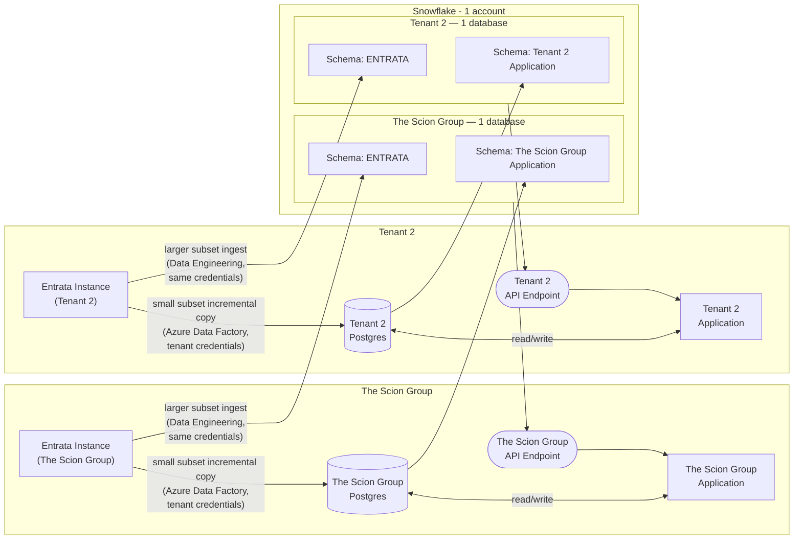

# Data Warehouse Ecosystem Diagram — Snowflake in Scion Intelligence 2.0

## Assumptions

- One Snowflake account, hosted in the United States. Other Snowflake accounts may exist later in different countries.
- Multi-tenant architecture. Diagram below shows 2 tenants to start; the pattern repeats per tenant.
- Each tenant has its own Postgres database backing its application.
- Shows one source system today — Entrata — with more sources expected.
- Onboarding flow: a tenant provides credentials to their Entrata instance. Azure Data Factory uses those credentials to pull a small subset of Entrata data into the tenant's Postgres database for the application to use.
- Data Engineering reuses those same Entrata credentials to pull a larger subset of Entrata data for analytical use (BI and data science).
- The tenant's application reads/writes data directly in Postgres, so that Postgres data also needs to be incrementally copied into Snowflake. Each source gets its own schema — in this case one schema for Entrata, one for the tenant's application data.
- Each tenant gets its own database inside Snowflake. The ENTRATA schema and the tenant's application schema shown below are two schemas living inside that single per-tenant database, not separate databases.
- The Postgres → Snowflake incremental copy runs as a batch job orchestrated by Airflow, using the Azure equivalent of the ECS operator (AzureContainerInstancesOperator) to spin up a container for the run and tear it down afterward.

## Diagram

## Important Notes

- **Drift between subsets** — The data team expects the Entrata data within the Data Engineering ingest to be different from Entrata data copied via Azure Data Factory. This drift is for the data team to reconcile.
- **Tenants are different** — The orchestration code is expected to be different for each tenant. The data team expects the orchestration code not to scale across tenants.
- **Coordinated orchestration** — The data team uses the same tool (Airflow suggested) for ingestion and transformation. Hopping between systems to troubleshoot issues is for rabbits.
- **Lean** — The data team aims first for incremental ingestions and transformations with the option of manually triggering full refreshes on demand. We accept that there will be use cases where it is required to do full refreshes on schedule, but it's not our default behavior.
- **Ownership** — The data team owns the ingestion into Snowflake, not the ingestion into the Scion Intelligence 2.0 application. Data team also is responsible for pushing to tenant endpoints via the same orchestration tool.
- **Access to Snowflake** — Internal staff ONLY (data engineering, data science, analysts). Scion Intelligence 2.0 does not directly query the Snowflake data warehouse.
- **Analytics** — The data team creates a trusted gold layer, thereby minimizing the need for any layer between a BI tool and the data warehouse. In other words, an analyst can plug directly into fact and dimension tables, know exactly how they are defined, and trust them.
