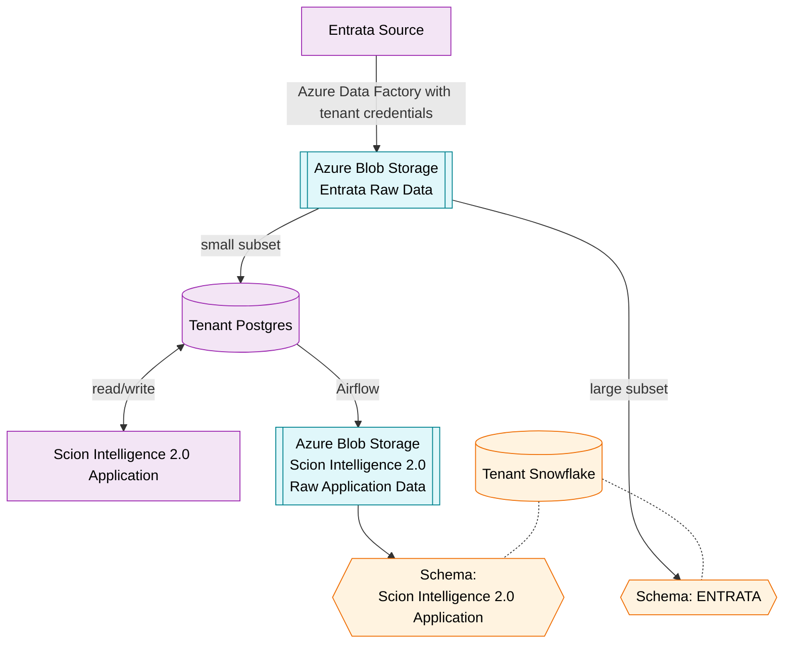

# Data Warehouse Ecosystem Diagram — Snowflake in Scion Intelligence 2.0

## Assumptions

- Two Snowflake instances exist per region — a primary (active) and a secondary (passive, used for disaster recovery/failover) — kept in sync. Functionally they operate as one logical account. Region is not defined in the
 sense that Azure would (Central US, East US, North Central US, etc.). An example region here would be the United States
 where a primary is hosted in North Central US and a secondary in Central US.
- Multi-tenant, but only 1 tenant shown below - with more tenants expected.
- The tenant has its own Postgres database backing its application.
- Shows one source system — Entrata — with more sources expected.
- Entrata instances are forced to conform at the system level — Entrata itself is configured so every tenant's instance produces data in the same shape. Conformity is enforced before any pipeline runs, not patched downstream via transformation.
 The responsibility of conformity lies with each tenant; for instance, a tenant may be required to make custom fields
 which Scion Intelligence 2.0 requires. In other words, the data team will not conform in the ingestion via mappings.
- All ingested data is landed and persisted in Azure Blob Storage before it reaches Postgres or Snowflake — a raw, permanent archive organized by source: one bucket holds Entrata's raw pull, a separate bucket holds the tenant's Postgres application data. This lets the data team reprocess or replay a load without re-pulling from the source system.
- Onboarding flow: a tenant provides credentials to their Entrata instance. Azure Data Factory uses those credentials to make a single pull from Entrata into its Blob Storage bucket. From that landed copy, a small subset loads into the tenant's Postgres database for the application, and a larger subset loads into Snowflake's ENTRATA schema for analytical use (BI and data science). There is no second, separate ingest pull from Entrata itself.
- The tenant's application reads/writes data directly in Postgres. That Postgres data is landed in its own Blob Storage bucket (separate from the Entrata bucket) for the data team to ingest from, then loaded into Snowflake. Each source gets its own schema in Snowflake — in this case one schema for Entrata, one for the tenant's application data.
- Each tenant gets its own database inside Snowflake. The ENTRATA schema and the tenant's application schema shown below are two schemas living inside that single per-tenant database, not separate databases.
- The Postgres → Blob Storage → Snowflake load runs as a batch job orchestrated by Airflow, using the Azure equivalent of the ECS operator (AzureContainerInstancesOperator) to spin up a container for the run and tear it down afterward.

## Diagram

## Important Notes

- **Drift between subsets** — The data team expects the small subset routed to Postgres to differ from the large subset routed to Snowflake, even though both originate from the same Azure Data Factory sync. This is simply because the tenant is performing CRUD operations in Postgres.
- **Staging in Blob Storage** — Blob Storage is a permanent raw archive, not a transient pass-through: data stays there indefinitely so the data team can reprocess or replay a load without re-pulling from Entrata or re-copying from Postgres. Entrata's raw pull and the tenant's Postgres data land in separate buckets.
- **Tenants are conformed** — The orchestration code is expected to be the same for each tenant, so no mapping will 
 need to be applied to conform data. The tenant is forced to conform at the source level.
- **Coordinated orchestration** — The data team uses the same tool (Airflow suggested) for ingestion and transformation. Hopping between systems to troubleshoot issues is for rabbits.
- **Lean** — The data team aims first for incremental ingestions and transformations with the option of manually triggering full refreshes on demand. The data team accept that there will be use cases where it is required to do full refreshes on schedule, but it's not our default behavior.
- **Ownership** — The data team owns all ingestions into Snowflake, not the ingestion into the Scion Intelligence 2.0 postgres database. Data team also is responsible for pushing to tenant endpoints via the same orchestration tool.
- **Access to Snowflake** — Internal staff ONLY (data engineering, data science, analysts). Scion Intelligence 2.0 does not directly query the Snowflake data warehouse.
- **Analytics** — The data team creates a trusted gold layer downstream of all raw Snowflake schemas, thereby minimizing the need for any layer between a BI tool and the data warehouse. In other words, an analyst can plug directly into fact and dimension tables, know exactly how they are defined, and trust them.
- **Data Science** — There would be no need to cross-query across 'different data warehouses'. Functionally, it will 
 feel as though there is one single data warehouse of truth.